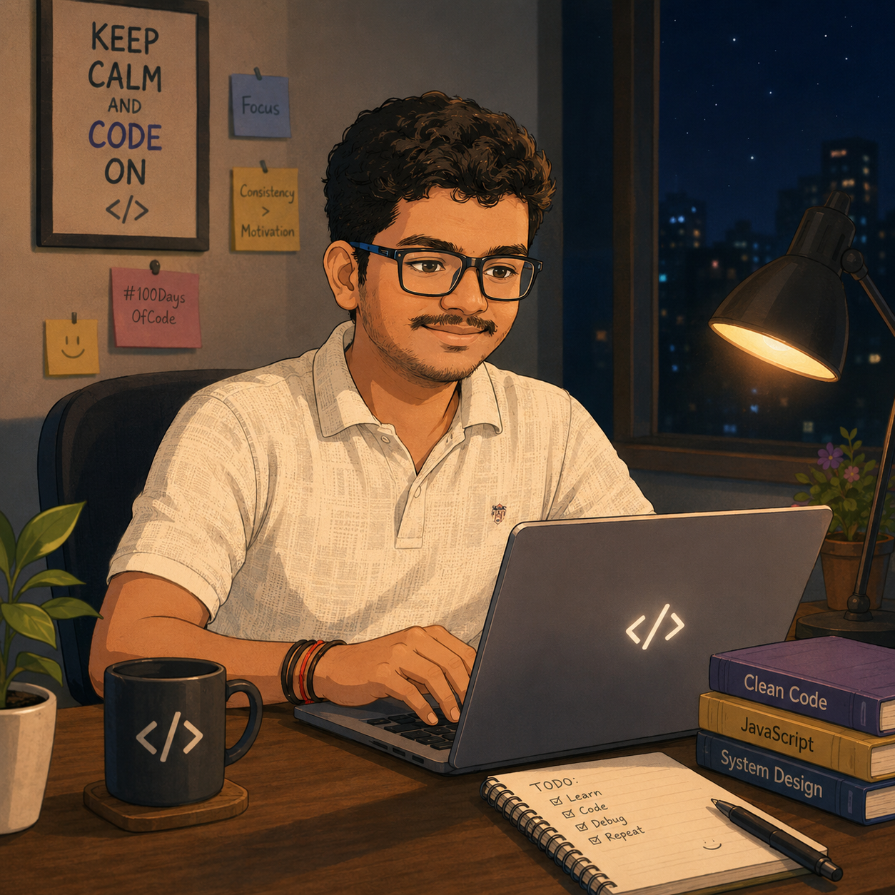

# Hi 👋 I'm Rushikesh Sarap

### Computer Engineering Student • Backend Developer • AI Enthusiast

Building scalable applications, exploring AI systems, and solving real-world problems through software engineering.

---

## 🚀 About Me

* 🎓 B.E. Computer Engineering Student
* 💻 Passionate about Backend Development, AI and System Design
* 🌱 Currently mastering Data Structures & Algorithms
* 🔐 Interested in Security, Scalable Systems and Cloud Computing
* 🏗️ Building full-stack applications with modern technologies
* 🎯 Preparing for Software Engineering roles

---

## 🛠️ Tech Stack

### Languages

### Development

### Tools & Platforms

---

## 🌟 Featured Projects

### 🔨 BidBazaar – Online Auction Platform

Full-stack auction platform with authentication, bidding system, product management and secure backend architecture.

### 🤖 AI & Machine Learning Projects

Exploring machine learning fundamentals, predictive systems and intelligent applications.

### 📊 Data Structures & Algorithms

Collection of optimized solutions and problem-solving approaches.

---

## 🎯 Current Focus

* Advanced Data Structures & Algorithms
* System Design Fundamentals
* Backend Development with Node.js
* Machine Learning & AI
* Placement Preparation

---

## 📫 Contact

📧 **[saraprushikesh05@gmail.com](mailto:saraprushikesh05@gmail.com)**

💼 **LinkedIn:** https://www.linkedin.com/in/rushikesh-sarap/

---

### ⭐ If you like my work, consider starring my repositories!

